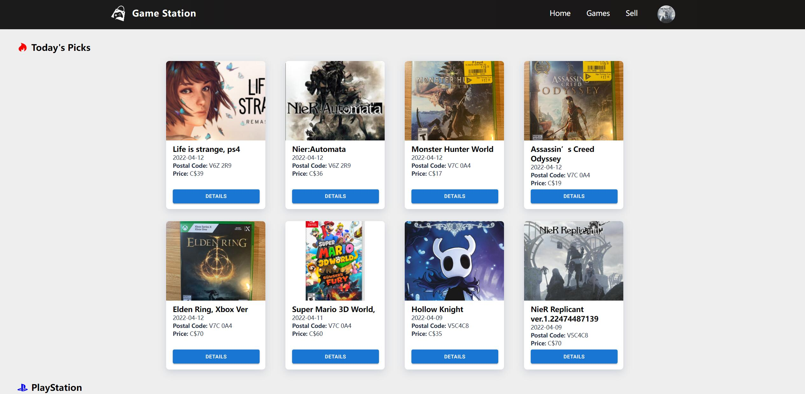
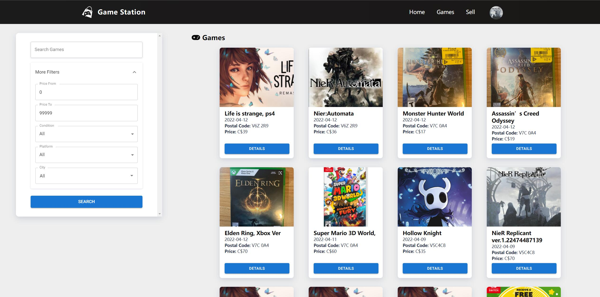
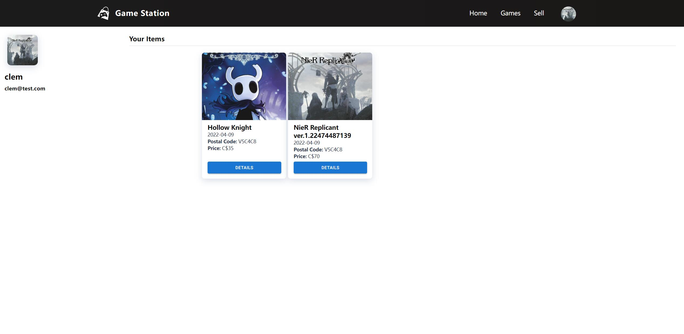
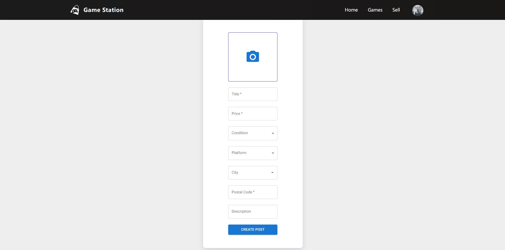
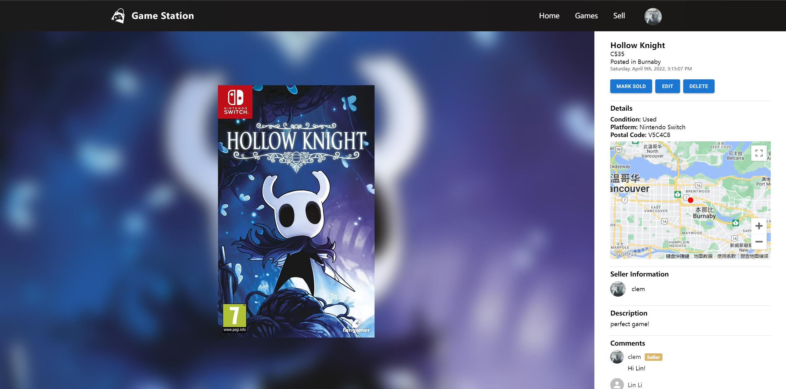

# Game Station

We built a website where gamers in Canada can trade second-handed
video games with the least amount of effort. Nowadays GameStop is a well-known platform
for this purpose, but GameStop stores offer relatively lower prices for game owners and
sell second-handed games at higher prices so that they can make profits. Our goal is to
build an end-to-end platform to bring gamers together for sharing their games.

## List of Features

1. We will use Auth0 to take care of the authentication and authorization of our users.
   When registering, we will also require some additional information such as this user’
   avatar, home address, and contact information for easy trade.
2. Our homepage will display game listings based on trends and different platforms.
   Logged-in users will also see their current listings (which are posted for sale or which
   are already sold).
3. If you want to search for specific games, you can type keywords plus several filters
   such as location, platform, price range, etc., to get the search results.
4. If you click on a game item on the homepage or search results page, you will be
   directed into the game listing details page, you can see additional pictures of the game,
   its price, its platform, its used-state, where you can pick it (We’ll use Google Maps
   API to show a mini-map), and comments that are posted by other potential buyers or
   viewers. Logged-in users can post comments.
5. Users can sell their games by clicking the “Sell” button and submitting a form containing the
   the information mentioned above.
6. When logged-in users click their name or avatar, they will be directed to the user profile
   page, where they can edit their personal information and see current or historical
   listings.

## Screenshots

Homepage

Game Page

Profile Page

Sell Page

Detail Page

## Contributions

Home Page: Pan Wang, Yu Gao

Game Detail Page: Pan Wang, Lin Li

Sell Page: Lin Li, Pan Wang

Profile Page/User Authorization: Yu Gao

Server Side: Lin Li, Yu Gao
